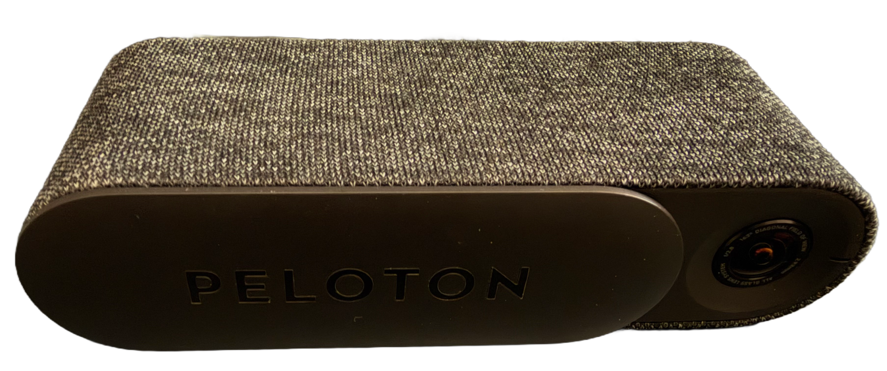
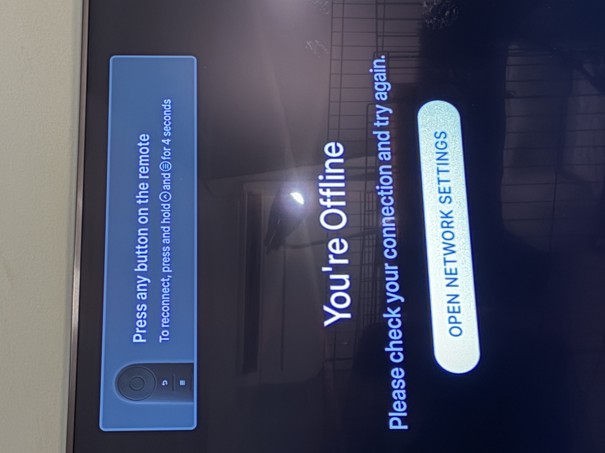

# Peloton Guide PT01: access and recovery research

Field notes for investigating a Peloton Guide identified on its product label as model **PT01**. The goal was to determine what access is available over USB, whether ADB can be enabled without the original remote, and how far a Bluetooth remote emulator can get.

This is independent research, not an official Peloton procedure. It is intentionally evidence-led: confirmed observations are separated from hypotheses and experiments.

## Current result

The strongest confirmed access path is the bootloader:

| Interface or path | Result |
| --- | --- |
| USB physical connection | Confirmed; macOS enumerates the Guide at 480 Mbps |
| Normal Android ADB | Not available; \`adb devices -l\` stayed empty |
| Fastboot | Confirmed after a mic-at-plug-in experiment; product is \`tiger\` |
| Fastboot read-only variables | Available |
| Fastboot unlock | Refused: \`unlock is not allowed for user build\` |
| Fastboot partition fetch | Not supported by this bootloader |
| Stock recovery ADB | Not observed; \`fastboot reboot recovery\` fell through to normal Android boot |
| Qualcomm EDL | Not attempted in this report |
| Generic Bluetooth HID remote | No Guide connection observed |

The bootloader reported \`secure: yes\`, \`unlocked: no\`, \`get_unlock_ability: 0\`, \`variant: QCS EMMC\`, and A/B slots. No partition was erased or flashed. The failed unlock request did **not** wipe the device.

## Start here

1. Keep the Guide connected directly by a known-good data cable.
2. Run the read-only USB checks in [docs/reproduce.md](docs/reproduce.md).
3. Reproduce the physical fastboot trigger described there. The exact button/switch sequence is not confirmed as an official Peloton procedure.
4. Once fastboot appears, collect \`getvar\` output before attempting any write.
5. Do not assume that fastboot means ADB is enabled. ADB requires Android USB debugging or a recovery \`adbd\` endpoint.

## Device evidence

The label photo was used to verify the PT01 model and correlate the hardware serial with the USB/fastboot identity. The unredacted label is deliberately not committed because it contains a unique device serial. See [evidence/README.md](evidence/README.md).

## Important safety boundary

Entering fastboot is reversible and gave useful read-only information. The following are materially different:

- \`fastboot flashing unlock\` can factory-reset a device if accepted.
- EDL is a low-level Qualcomm storage transport, not ADB. A matching, authorized programmer and exact firmware are required for useful operations.
- Flashing or erasing bootloader, GPT, \`persist\`, modem, or Bluetooth-related partitions can leave the Guide unable to boot or lose calibration and device-specific data.

The only unlock attempt documented here was explicitly authorized, targeted to the observed device, and refused by the bootloader before any wipe.

## Repository map

- [docs/findings.md](docs/findings.md) — consolidated evidence and observations.
- [docs/reproduce.md](docs/reproduce.md) — commands and a conservative reproduction runbook.
- [docs/bluetooth.md](docs/bluetooth.md) — remote pairing screen and emulator experiments.
- [docs/next-steps.md](docs/next-steps.md) — realistic next investigations, including EDL.
- [evidence/](evidence/) — public-safe photographs used in the report.
